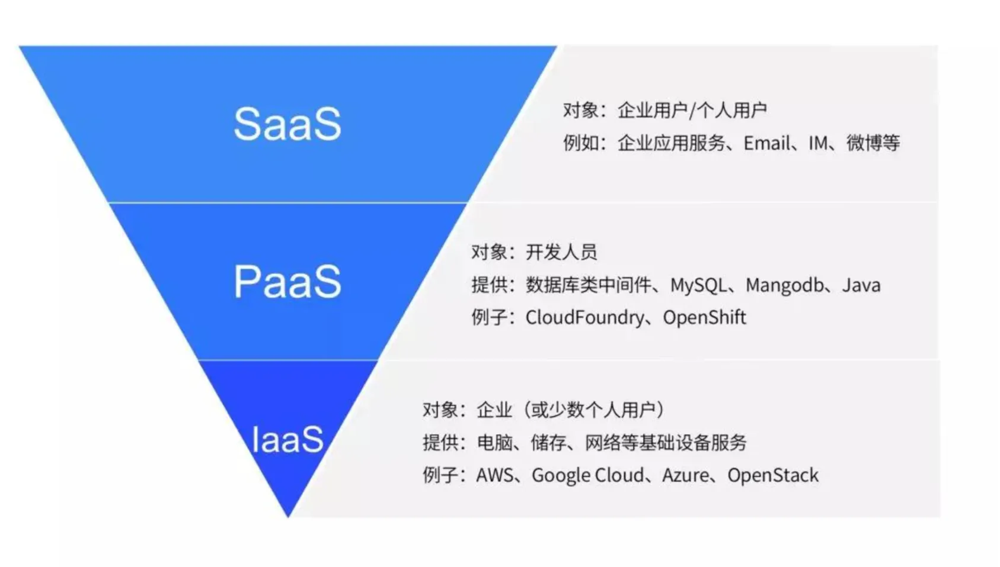
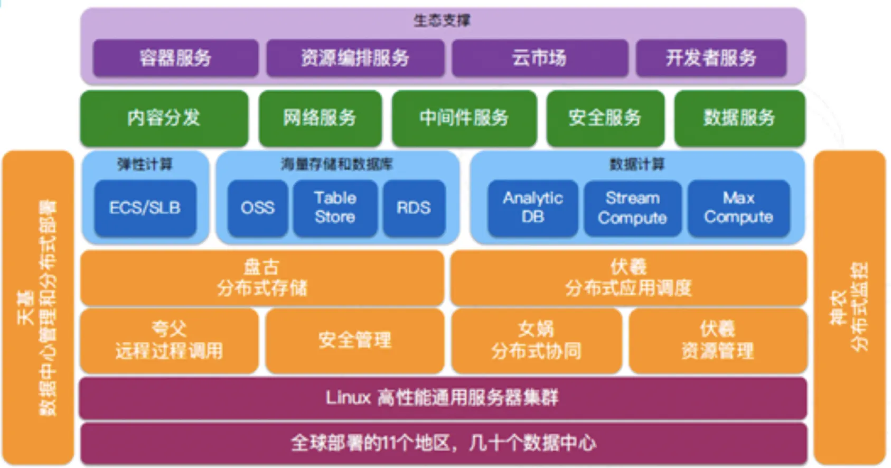
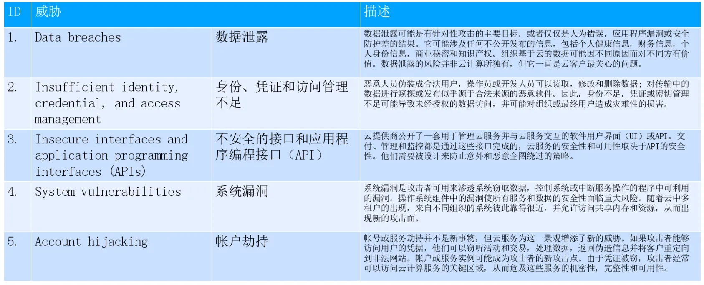
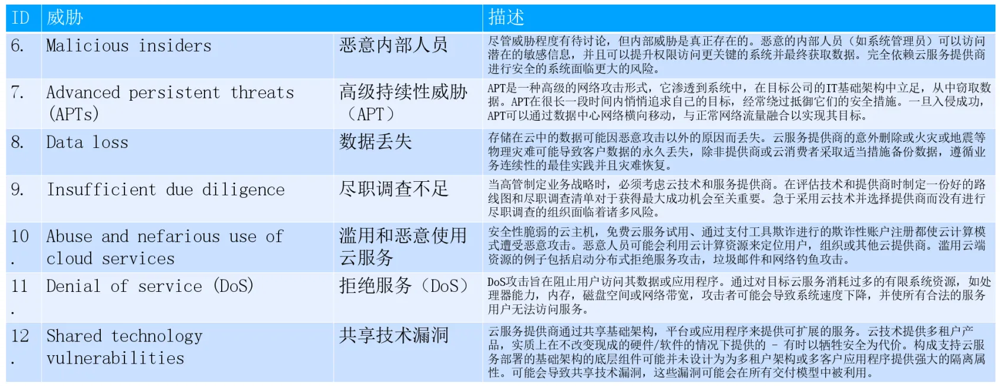
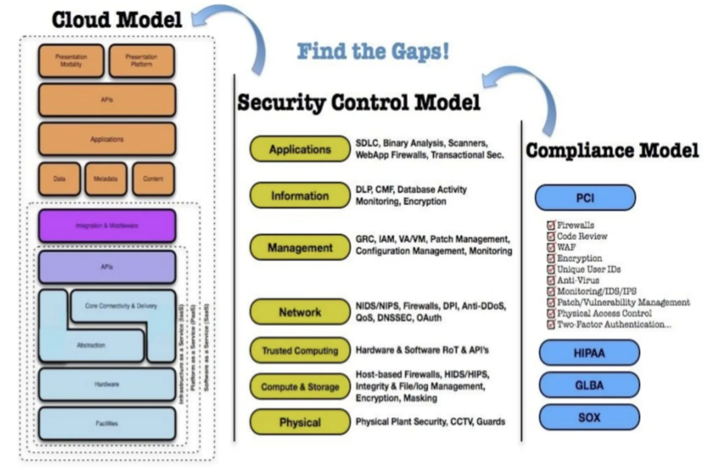
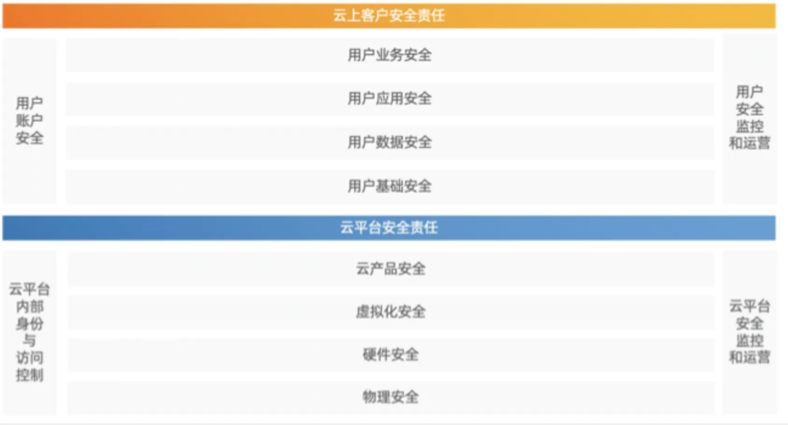
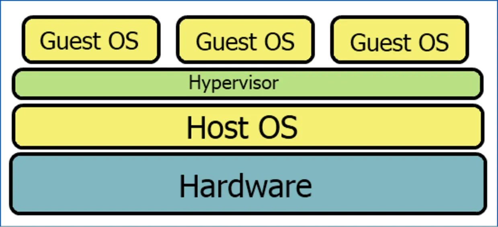
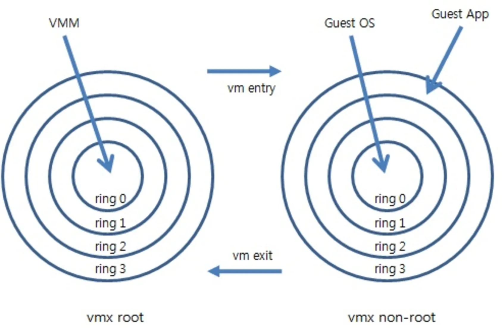
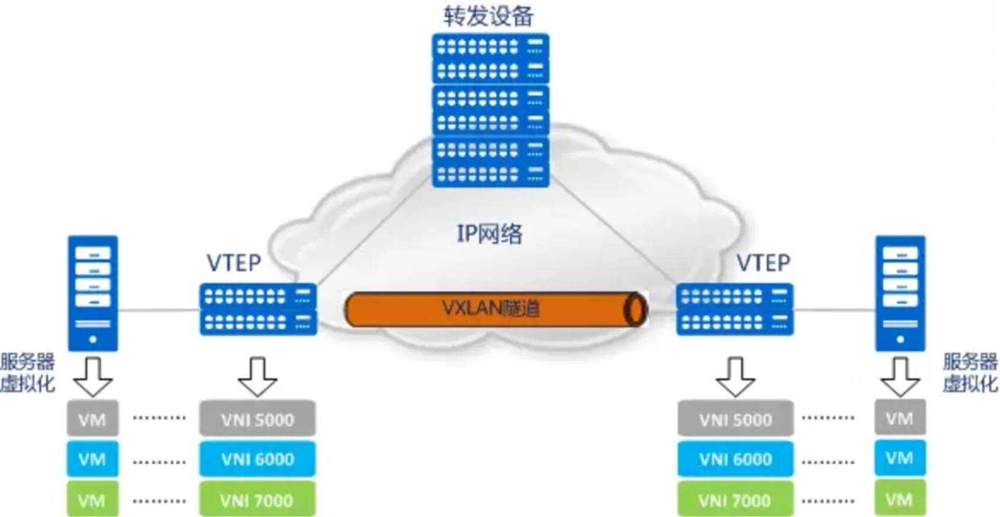
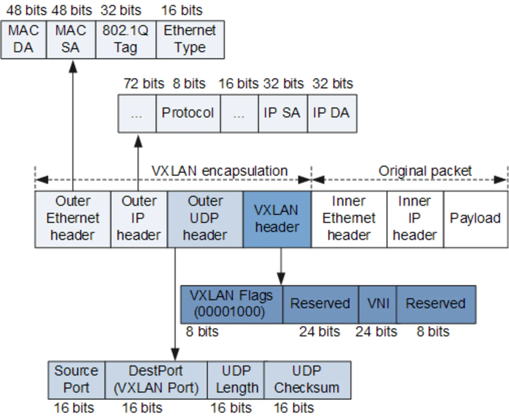

## 一、云计算业界定义 

云计算的最终目标是将计算、服务和应用作为一种公共设施提供给公众，使人们能够像使用水、电、煤气和电话那样使用计算机资源。

到目前为止， 云计算还没有一个统一的定义。云计算领先者如 Google、Microsoft 等厂商，依据各自的利益和各自不同的研究视角都给出了对云计算的定义和理解。

维基百科：云计算是一种动态扩展的计算模式，通过网络将虚拟化的资源作为服务提供；通常包含 IaaS、PaaS、SaaS。

Google：将所有的计算和应用放置在“云”中，设备终端不需要安装任何东西，通过互联网络来分享程序和服务。

微软：认为云计算的应是“云+端”的计算，将计算资源分散分布，部分资源放在云上，部分资源放在用户终端，部分资源放在合作伙伴处，最终由用户选择合理的计算资源分布。

研究机构 IDC：认为云计算是一种新型的 IT 技术发展、部署及发布模式，能够通过互联网实时的提供产品、服务和解决方案。

美国国家标准与技术实验室：云计算是一个提供便捷的通过互联网访问一个可定制的 IT 资源共享池能力的按使用量付费模式（IT 资源包括网络，服务器，存储，应用，服务），这些资源能够快速部署，并只需很少的管理工作或与服务供应商的交互。

## 二、云计算服务模型与平台 

### 1）云计算典型模型 

分为四类：传统 IT 全管理、IaaS 硬件管理、PaaS 服务管理、SaaS 全管理

### 2）云计算典型应用 

### 3）云平台基础架构 

计算虚拟化、存储虚拟化、网络虚拟化，还有部署、监控和安全等模块。

### 4）云计算的优势与不足 

节约成本：由于不需要任何物理硬件投资，它可以帮助您节省大量的资本成本。

快速部署：只需点击几下即可快速部署服务。这种更快的部署使您能够在几分钟之内获得系统所需的资源。

提供弹性计算：可以立即快速地增加容量，还可以缩减产能以降低成本。

按需自助服务：用户可以按需方便地自助地获得资源。

允许按使用付费：企业根据需要使用任何产品，而不必为自己不用的软件付费

多租户：快速有效的虚拟化、提供低成本软件、提供高级在线安全性、始终可用，自动缩放以适应需求的增长、基于 Web 的控件和界面、提供 API 访问权限

性能不稳定：您的应用程序正在服务器上运行，该服务器同时向其他企业提供资源。

技术问题：云技术总是容易出现中断和其他技术问题。

云中的安全威胁：与第三方云计算服务提供商共享公司的所有敏感信息。黑客可能会访问此信息。

停机时间：云提供商可能面临断电，互联网连接低，服务维护等问题。

互联网连接：没有互联网连接，您将无法访问云。

较低的带宽：超过了给定的限额，那么额外的费用可能会非常昂贵

缺乏支持：可能无法为客户提供适当的支持。

## 三、云计算安全威胁 

云安全联盟（CSA） “云计算 12 个主要威胁”

## 四、云计算安全架构 

### 1）云安全控制模型 

通过云服务模型与安全控制模型或合规模型进行比对，判断已有安全措施、不足的安全措施，找到安全差距。

通过差距分析找到安全短板，进行安全规划建设和实施落地，提供多维度、综合立体的安全架构保障。

### 2）云安全责任共担模型 

云要保障云平台自身安全并提供安全产品和能力给云上客户；客户负责基于云服务构建的应用系统的安全。 基于云的客户应用，其安全责任由双方共同承担。

### 3）云安全矩阵 CCM 

CSA CCM（Cloud Control Matrix，云控制矩阵）提供了评估云提供商整体安全风险的基本安全准则。通过对其他行业标准和监管要求的定制，CSA CCM 分为 16 个域，133 个控制项，内构建了统一的控制框架，通过减少云中的安全威胁和弱点加强现有的信息安全控制环境，提供标准化的安全和运营风险管理，并寻求将安全期望、云分类和术语体系，以及云中实施的安全措施等标准化。

## 五、虚拟化技术介绍 

### 1）计算虚拟化隔离技术 

全虚拟化

动态二进制翻译，过滤所有虚拟机发送请求，动态完成敏感指令翻译，不需要修改 Guest os 内核，Hypervisor 层监控，动态翻译时需要 VMM 资源，依赖 VMM。VirtualPC VMWare workstation

半虚拟化

必须修改 Guest os 内核，性能几乎等于物理机，对 VMM 依赖少，支持多种 OS 用 Hypercall 方式做敏感指令。Xen Hyper-v

硬件辅助虚拟化

动态完成敏感指令翻译，不需要修改 Guest os，两套特权级，两个 Ring0，性能最强，需要硬件支持。Inter-VT AMD -V

Intel-VT 在 ring0~ring3 的基础上，增加了 VMX 模式，VMX 分为 root 和 non-root。这里的 VMX root 模式是给 VMM（VM monitor)。VMX non-root 模式就是运行的 Guest，Guest 也分 ring0~ring3，不过他并不感知自己处于 VMX non-root 模式下。

VMM 与 Guest 的切换

Guest 与 VMM 之间的切换分两个部分：VM entry 和 VM exit。有几种情况会导致 VM exit，比如说 Guest 执行了硬件访问操作，或者 Guest 调用了 VMCALL 指令或者调用了退出指令或者产生了一个 page fault，或者访问了特殊设备的寄存器等。当 Guest 处于 VMX 模式的时候，没有提供获取是否处于此模式下的指令或者寄存器，也就是说，Guest 不能判断当前 CPU 是否处于 VMX 模式。当产生 VM exit 的时候，CPU 会将 exit reason 保存到 MSRs（VMX 模式的特殊寄存器组），对应到 KVM 就是 vCPU->kvm_run->exit_reason。VMM 根据 exit_reason 做相应的处理。

VMM 的生命周期

如上图所示，VMM 开始于 VMXON 指令，结束与 VMXOFF 指令。

第一次启动 Guest，通过 VMLAUNCH 指令加载 Guest，这时候一切都是新的，比如说起始的 rip 寄存器等。后续 Guest exit 后再 entry，是通过 VMRESUME 指令，此指令会将 VMCS(后面会介绍到）所指向的内容加载到当前 Guest 的上下文，以便 Guest 继续执行。

VMCS （Virtual-Machine control structure)

顾名思义，VMCS 就是虚拟机控制结构，前面提到过很多次，Guest Exit 的时候，会将当前 Guest 的上下文保存到 VMCS 中，Guest entry 的时候把 VMCS 上下文恢复到 VMM。VMCS 是一个 64 位的指针，指向一个真实的内存地址，VMCS 是以 vCPU 为单位的，就是说当前有多少个 vCPU，就有多少个 VMCS 指针。VMCS 的操作包括 VMREAD，VMWRITE，VMCLEAR。

### 2）网络虚拟化隔离技术 

VXLAN（Virtual eXtensible Local Area Network，虚拟扩展局域网）是由 IETF 定义的 NVO3（Network Virtualization over Layer 3）标准技术之一，采用 L2 over L4（MAC-in-UDP）的报文封装模式，将二层报文用三层协议进行封装，可实现二层网络在三层范围内进行扩展，同时满足数据中心大二层虚拟迁移和多租户的需求。

VTEP（VXLAN Tunnel Endpoints，VXLAN 隧道端点）

VXLAN 网络的边缘设备，是 VXLAN 隧道的起点和终点，VXLAN 报文的相关处理均在这上面进行。

VNI（VXLAN Network Identifier，VXLAN 网络标识符）

以太网数据帧中 VLAN 只占了 12 比特的空间，这使得 VLAN 的隔离能力在数据中心网络中力不从心。而 VNI 的出现，就是专门解决这个问题的。VNI 是一种类似于 VLAN ID 的用户标示，一个 VNI 代表了一个租户，属于不同 VNI 的虚拟机之间不能直接进行二层通信。

VXLAN 隧道

“隧道”是一个逻辑上的概念，将原始报文“变身”下，加以“包装”，好让它可以在承载网络（比如 IP 网络）上传输。从主机的角度看，就好像原始报文的起点和终点之间，有一条直通的链路一样。而这个看起来直通的链路，就是“隧道”。顾名思义，“VXLAN 隧道”便是用来传输经过 VXLAN 封装的报文的，它是建立在两个 VTEP 之间的一条虚拟通道。

VXLAN 在 VTEP 间建立隧道

VXLAN 报文格式

## 六、最后小结 

云计算已经是大势所趋，越来越多的业务向云上迁移，伴随而来的云安全风险也逐渐显现，云安全必将是基础设施安全的重要环节。面对复杂的云安全风险，借鉴成熟的云安全框架模型扩宽视野，深挖虚拟化技术底层原理，从产品安全、数据安全、实体认证鉴权到代码和数据防篡改和底层技术自主可控，需要分阶段分优先级逐步落地安全风险解决方案。