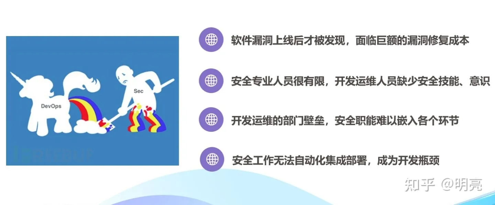
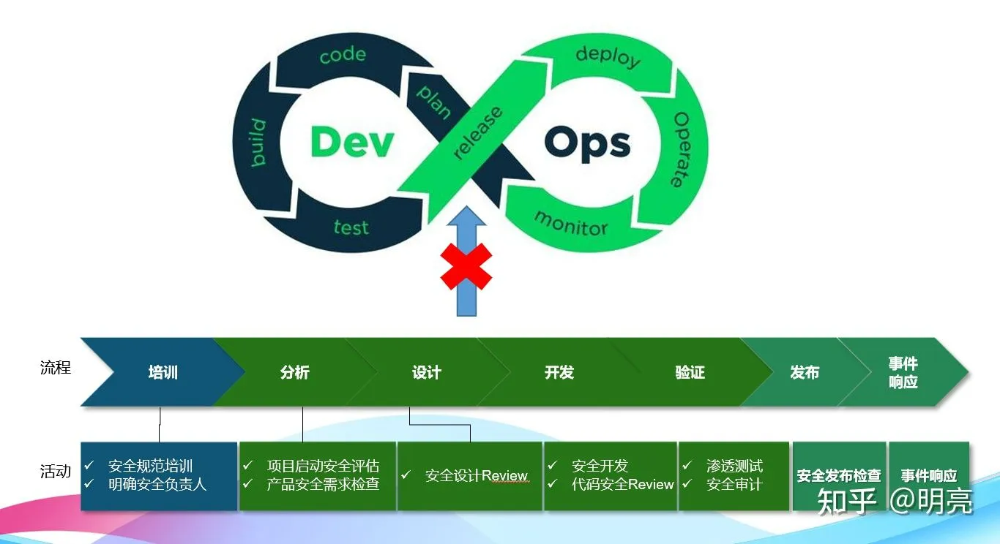
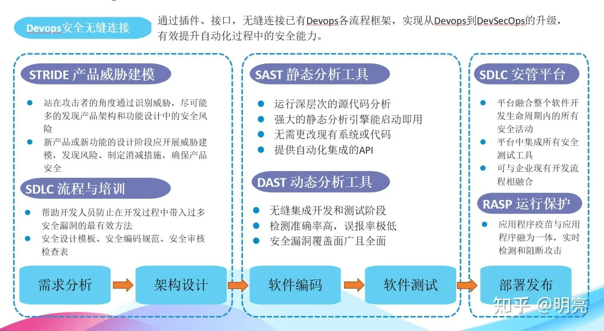

大多数安全漏洞发生在应用程序层，NIST曾发布过调查数据，75%的安全漏洞发生在应用程序层，而非以往认为的网络层，足见软件安全性问题。

软件上线后面临巨额的漏洞修复成本，在软件发布甚至上线运营后频繁出现严重安全问题，则将不仅会给软件发布者产生巨额的公关和漏洞修复成本，还会使其自身的品牌口碑、公信力带来巨大损害。

误报问题是研发安全建设的关键痛点，现有研发安全商业工具的误报问题，是研发安全建设中的关键痛点，误报问题导致的直接结果，是来自一线研发人员的安全落地阻力。

研发团队负责开发交付、运维团队负责可用性保障、安全团队负责安全保障的方式完成IT业务的管理，导致安全、开发和运维部门业务目标相互独立、割裂，有时甚至是对立和冲突，最终导致安全风险的闭环管理时间周期长、成本高。

## 一、DevOps项目中的SDL 

在DevOps项目持久交付和快速迭代中，SDL因为节奏缓慢很难被业务部门接受。安全团队需要提供可持续集成的安全工具，不断优化安全流程。

## 二、DevSecOps理念 

DevSecOps 是一种结合了开发 (Dev)、安全 (Sec) 和运维 (Ops) 的安全理念，旨在在整个软件开发生命周期中提高安全性。DevSecOps 的核心思想是将安全考虑融入整个软件开发过程中，在软件开发的早期阶段就要考虑安全问题，从而提高软件的安全性。

## 三、DevSecOps安全技术流程 

DevSecOps，一种全新的安全理念与模式，从DecOps的概念延伸和演变而来，其核心理念为安全是整个IT团队（包括开发、运维及安全团队）每个人的责任，需要贯穿从开发到运营整个业务生命周期的每一个环节。

DevSecOps 主要通过自动化安全测试，安全评估，威胁建模和安全文化来保证在整个软件生命周期中提高安全性，并减少漏洞数量，保证应用程序和基础架构的安全性，并加快产品的发布速度。

## 四、威胁建模和安全防御原则 

### STRIDE威胁建模和对应措施 

STRIDE 是一种常用的威胁建模框架，它是由微软研究院开发的。STRIDE 是一种通用的威胁建模方法，它可以帮助开发人员和安全专家识别和评估潜在的安全威胁。

STRIDE 代表了六种威胁类型：

1Spoofing (伪装)：指攻击者冒充另一个实体来获取系统资源或敏感信息。包括 IP 地址伪装、用户名伪装等。

2Tampering (篡改)：指攻击者篡改系统数据或应用程序，导致系统或应用程序功能缺陷或数据丢失。

3Repudiation (否认)：指攻击者否认发起或参与了某一操作，如欺骗用户或系统。

4Information disclosure (信息泄露)：指攻击者非法获取系统中的敏感信息。

5Denial of service (拒绝服务)：指攻击者通过消耗系统资源等手段使系统无法提供正常服务。

6Elevation of privilege (特权提升)：指攻击者通过绕过系统安全控制来获取高权限，如提升用户权限或获取系统管理员权限。这种威胁通常是通过漏洞利用、暴力破解、社工攻击等手段实现的。

| 威胁类型    | 缓解措施   | 技术方案                                     |
| ----------- | ---------- | -------------------------------------------- |
| 仿冒(S)     | 认证       | Kerberos认证 PKI系统如SSL / TLS证书 数字签名 |
| 篡改(T)     | 完整性保护 | 访问控制 完整性校验                          |
| 抵赖(R)     | 日志审计   | 强认证 安全日志、审计                        |
| 信息泄露(I) | 保密性     | 加密 访问控制列表                            |
| 拒绝服务(D) | 可用性     | 访问控制列表 过滤 热备份                     |
| 权限提升(E) | 授权认证   | 输入校验 用户组管理 访问控制列表             |

### 安全防御原则 

1最小攻击面原则: 限制系统的攻击面，使其尽量小，减少攻击者的攻击点。

2默认安全原则: 系统默认的状态应该是安全的，需要特殊权限才能改变安全状态。

3权限最小化原则: 仅给予用户或程序最少的权限，以防止滥用权限导致安全问题。

4纵深防御原则: 使用多层防御措施，从防火墙、入站过滤到应用层防护，有效阻止威胁的传播。

5失败安全原则: 将系统设计为在遇到安全问题时能够安全地失效而不会导致灾难性后果。

6不信任第三方系统原则: 对于第三方系统和服务采取假定不信任的态度，对其进行适当的安全限制和监控。

7业务隔离原则: 将不同的业务和数据隔离开来，防止一个业务的安全问题影响其他业务。

8公开设计原则: 将系统设计公开透明，方便安全专家和社区对其进行审查和安全评估。

9简化系统设计原则: 设计简单的系统，减少复杂性，降低攻击面。

10使用白名单原则: 采用白名单机制，只允许特定的行为和数据，阻止未知的威胁。

## 五、DevSecOps关键技术 

### 1. 实现交互式应用程序安全测试（IAST）技术 

交互式应用程序安全测试技术（IAST技术），英文为Interactive Application Security Test，是系统安全测试引擎工作的核心技术。IAST技术将会实现自动获取应用程序上下文的数据，并把这些信息同时提供给静态和动态工具，从而快速而又精确地查找出漏洞。

IAST技术在应用程序内部执行。当程序运行时，能够持续地监视与查找漏洞；面向方面的编程技术使得安全测试系统可以在程序运行时嵌入安全分析，分析内容包括提取上下文内容、数据流和控制流，访问程序运行时传递的值，通过这些有价值的信息，安全测试系统可以达到其它工具所不能企及的精确度。

### 2.  实现实时应用程序自我防护（RASP）技术 

实时应用程序自我防护（RASP）技术，英文为 Runtime Application Self-Protection，是一种新型应用安全保护技术。RASP技术将保护程序像疫苗一样注入到应用程序，并与应用程序融为一体，能实时检测和阻断安全攻击，使应用程序具备自我保护能力，当应用程序遇到特定漏洞和攻击时不需要人工干预就可以进行自动重新配置应对新的攻击。这意味着，RASP 运行在程序执行期间，使程序能够自我监控和识别有害的输入和行为。

RASP技术能够让应用程序具备自我保护能力，且拥有实时性。因为拥有应用程序的上下文，它不仅可以分析应用程序的行为也可以结合上下文对行为进行分析，而且这些能持续不断的进行分析，一旦发现有攻击行为能立刻进行响应和处理。