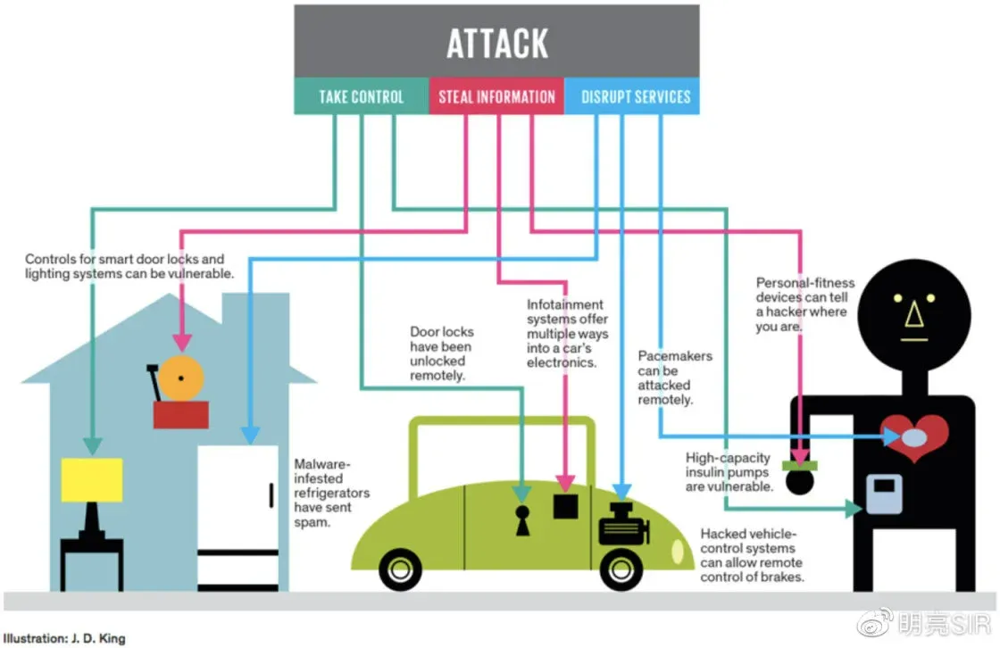

## 前言 

共享设备，可穿戴设备，智能家居，金融终端，人脸识别与 AI 等物联网设备增长迅猛，据统计全球的 IoT 设备数量已经达到 70 亿台，并且每年以 20%左右的速度增长。然而，当数以亿计的物联网设备在我们身边无声运转时，各种相关的安全问题也随之而来。物联网设备安全成为产品是否能得到市场认可的最大障碍，物联网设备与系统需要有效的防护措施，以免遭受恶意攻击，盗取和仿造用户身份。

## IoT 业务架构 

云智能物联网从业务架构角度来看，IoT 业务架构分为抽象为 3 层架构：

●物联网感知设备：是物联网系统的最终端设备或传感器，能够通过有线、无线方式发起或传感网络，采集物理信息或接受控制的实体设备。

●物联网边缘节点：是一套感知设备连接传统信息网络（有线网、移动网等）和传感网的桥梁，简单的感知层网关只是对感知数据的转发，而智能感知层网关将云端计算能力扩展到现场执行智能计算。

●物联网云端服务：统一设备数据管理，内置规则引擎，将设备数据转发、存储到应用集成可视化、AI 或机器学习等应用；统一设备远程控制管理，包括设备登记、设备鉴权、设备物模型管理等功能。

## 物联网安全设计 Security for IoT  

物联网是将感知节点设备通过互联网等网络连接起来构成的一个应用系统，它融合信息系统和物理世界实体，是虚拟世界与现实世界的结合。对物联网机密性、完整性、可用性、私密性的保护，并可能涉及真实性、责任制、不可否认性和可靠性等其他属性。 

### 1.IoT 设备与固件安全 

●串口安全：IOT 设备一般包含各类串口，并且这些串口缺乏认证机制。一旦暴露给了 hacker，hacker 可以很容易的查找敏感信息和 dump 固件，从而导致各类安全问题。建议厂家在推出 IOT 设备时，尽量关闭各类串口和加强认证机制。

●默认证书(密码)：默认证书(密码)是攻击者常用攻击目标之一，许多 IOT 设备使用相同的默认密码，并且用户不能主动修改该密码，hacker 可以在几分钟内就暴力破解这些密码，从而导致各类安全问题。Mirai 就是很好的例子，由于默认密码过于简单，并且无法修改，导致厂家只能召回设备修复该问题。

●硬编码问题：由于开发过程中的不规范，导致很多私钥，API keys，甚至是链接服务器的密码都被硬编码到固件中，导致敏感信息泄漏。可以使用一些自动化的脚本来扫描这类问题。

●加密：加密主要用于防止对数据和设备的未经授权访问。这一点估计有点困难，因为 IoT 设备以及硬件配置是各种各样的。一个完整的安全管理过程必须包括加密。

●交付机制：需要对设备持续得更新、打补丁，以应对不断变化的网络攻击。这涉及一些修复漏洞的专业知识，尤其是修复关键软件漏洞的知识。

### 2.IoT 通讯与协议安全 

●不安全的网络通信：不安全的网络通信是最常见的安全问题之一，这会导致攻击者获取到敏感信息(on the fly)，甚至搞清楚 IOT 设备的工作方式。例如，在智能家居开发的过程中，由于不安全的网络通信，我们可以伪造各类指令，实现控制整个系统。开发者和攻击者都需要能实现中间人攻击的工具，实现拦截，篡改，发送数据包的功能。

●不安全的无线通信：IOT 设备的无线通信协议一般是 wifi,BLE,zigbee,6LoWPAN 等。加密密钥一般在固件火灾闪存芯片中(使用 JTAG 或者其他技术可以获取到)。一旦攻击者获得这些密钥，则攻击者可以实现嗅探，篡改，伪造数据包。例如实现一个蠕虫，感染整个网络。开发者最好能保证加密的强度和完整性的校验来提升无线通信过程的安全性。

●缺乏完整性和签名的校验：对于 IOT 设备来说，完整性校验和签名校验是对抗漏洞利用强有力的手段。这些校验需要分布到 bootloader 一直到 OTA 的各个阶段，甚至是网络通信过程。缺乏这些校验，攻击者很容易就篡改网络中的组建，实现恶意行为，如获取敏感信息或者植入恶意代码。

●网络安全：IoT 网络现在以无线网络为主。在 2015 年，无线网络的流量已经超过了全球有线网络的流量。由于新生的 RF 和无线通信协议和标准的出现，这使得 IoT 设备面临着比传统有限网络更具挑战性的安全问题。

### 3.IoT 云端服务安全 

●不安全的移动和 WEB 应用：不安全的的移动和 WEB 应用是 13 个 IOT 关键安全问题之一。由于开发商缺乏对这类问题的关注，导致数百万用户面临安全风险。hacker 可以利用诸如 SQL 和 XML 注入，身份验证旁路和未经授权的访问等漏洞入侵 IOT 设备，进入工厂或者命令模式获取敏感信息等。

●接口保护：大多数硬件和软件设计人员通过应用程序编程接口（API）来访问设备，这些接口需要对需要交换数据（希望加密）的设备进行验证和授权的能力。只有经过授权，开发者和应用程序才能在这些设备之间进行通信。

●身份授权：IoT 设备必须由所有合法用户进行身份验证。实现这种认证的方法包括静态口令、双因素身份认证、生物认证和数字证书。物联网的独特之处在于设备（例如嵌入式传感器）需要验证其他设备。

●安全分析和威胁预测：不仅必须监视和控制与安全有关的数据，还必须预测未来的威胁。必须对传统的方法进行改进，寻找在既定策略之外的其它方案。预测需要新的算法和人工智能的应用来访问非传统攻击策略。

●系统开发：IoT 安全需要在网络设计中采用端到端的方法。此外，安全应该至始至终贯穿在整个产品的开发生命周期中，但是如果产品只是传感器，这就会变得略微困难。对于大多数设计者而言，安全只是一个事后的想法，是在产品实现（而不是设计）完成后的一个想法。事实上，硬件和软件设计都需要将安全考虑在整个系统当中。

