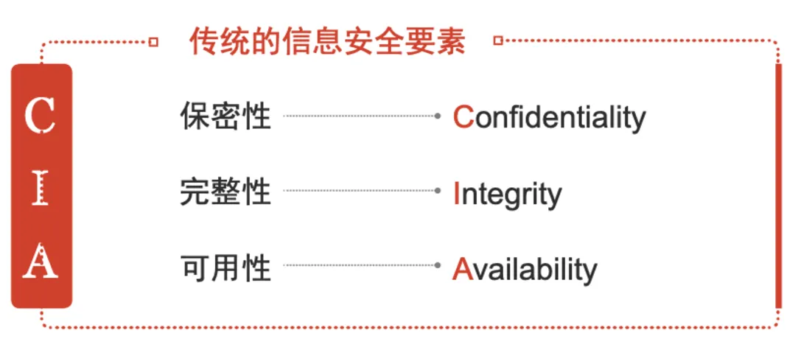
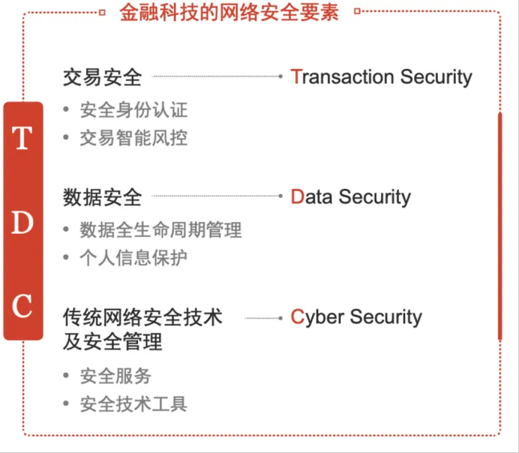
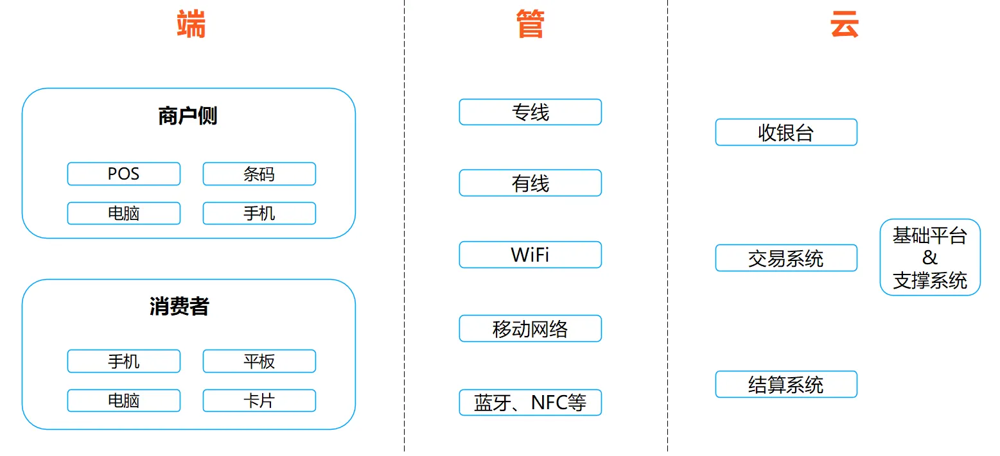
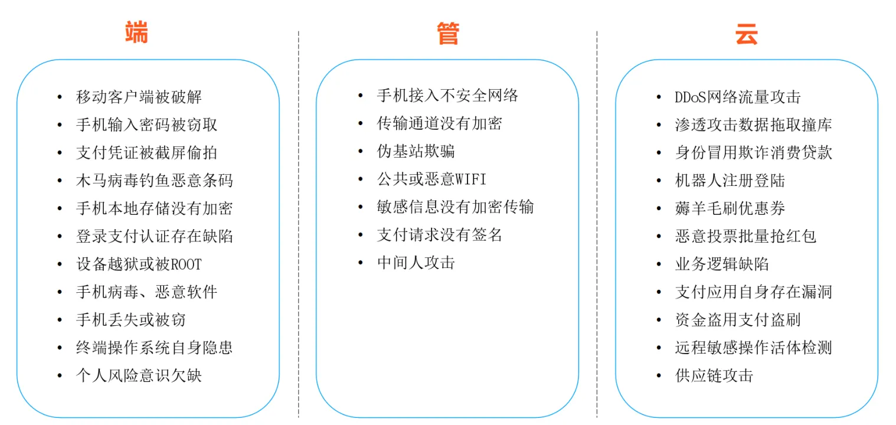
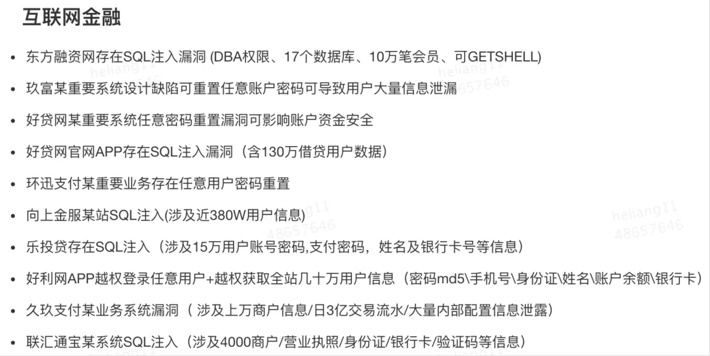
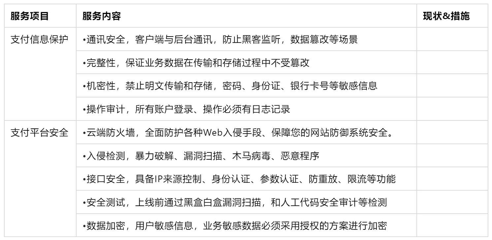

## 一、移动支付与支付安全基础概念 

### 1）移动支付定义 

移动支付是指消费者通过移动终端(通常是手机、PAD 等)对所消费的商品或服务进行账务支付的一种支付方式。客户通过移动设备、互联网或者近距离传感直接或间接向银行金融企业发送支付指令产生货币支付和资金转移，实现资金的移动支付，实现了终端设备、互联网、应用提供商以及金融机构的融合，完成货币支付、缴费等金融业务。

### 2）支付安全基本原则 

ISO 在《ISO/IEC 27000: 2014》中定义了信息安全，包括三个主要方面:保密性 (Confidentiality)、可用性(Availability)和完整性 (Integrity)。

金融科技信息安全的关键要素定义，信息安全必须与金融科技行业的网络安全特点及业务趋势相结合（交易安全、数据安全、传统安全）。

支付安全的基本原则，移动支付应实现交易双方身份认证及交易数据的机密性、完整性、抗抵赖性等，这也是金融支付安全的核心要求。

支付安全目标

●交易双方身份认证：交易开始前应确认交易双方身份。

●交易数据机密性：交易过程中应保证业务数据不可侵犯，采用加密或其他有效措施实现业务数据传输和存储的保密性。

●交易数据完整性：交易过程中保证业务数据在传输和存储过程中不受篡改。

●交易抗抵赖性：交易双方均不能否认或抵赖已发生的交易事件，应能为双方提供数据源发证据或数据接收证据。

### 3）监管合规角度支付安全背景 

（1）非银行支付机构纳入国家监管体系，拥有了合法的身份。

（2）第三方电子支付系统应符合网络安全等级保护第三级安全保护等级的基本要求。

（3）为贯彻执行国务院关于金融领域密码应用的指导意见，中国人民银行发布了非银行支付机构关于数字证书应用的要求，其中规定支付机构采用数字证书、电子签名作为验证要素的，数字证书及生成电子签名的过程应符合《中华人民共和国电子签名法》《金融电子认证规范》以及国家密码管理局等有关规定，确保数字证书唯一性、完整性及交易的不可抵赖性。

（4）第三方电子支付系统针对电子支付安全的基本要素包括身份识别、交易验证、交易信息保护、支付指令保护。其中身份识别，指客户在发起支付指令进行支付交易之前，需先对客户身份进行识别，针对支付账户的客户实行实名制管理；交易验证指按规定采取客户支付指令的验证措施；交易信息保护，是指电子支付系统应当确保交易信息的真实性、完整性、可追溯性以及在支付全流程中的一致性，不得篡改或者隐匿交易信息；支付指令保护是指电子支付系统应当确保电子支付指令的完整性、一致性、可跟踪稽核和不可篡改。这些安全要素的实现需应用密码技术。

### 4）消费者角度支付安全需求 

 移动支付验证方式 

 移动支付安全期待 

数据来源：中国银联 2019 移动支付安全大调查报告

## 二、移动支付网络架构和安全风险 

### 1）移动支付网络模型 

### 2）移动支付安全风险问题 

## 三、金融支付安全损失事件案例 

### 1）金融强监管行政处罚案例 

重罚 716 万！国内多家金融机构因数据泄露被行政处罚

中国人民银行发布了一则高达 716 万元的行政处罚信息，处罚对象包括四大国有银行和民生、光大、广发、中信、浦发等多家银行，还包括保险公司、资产管理公司等多家金融机构。

这些金融机构在过去两个月时间里，都曾发生泄露信息、瞒报数据等违规行为，有银行机构不仅过失泄露信息，而且未经授权便查询个人信用信息，甚至违法出售个人信息。

据调查发现：有 73%的金融员工表示，他们可以很轻松访问到内部敏感数据。

江苏江南农村商业银行股份有限公司因网络安全工作严重不足，江苏银保监局根据《中华人民共和国银行业监督管理法》第四十六条第（五）项，罚款人民币 30 万元。

### 2）遭黑客攻击入侵案例 

●某互联网金融平台刚上线就无法访问。平台才新上线没几天就遭到黑客攻击，导致站点无法访问，网站维护工程师也束手无策。无奈之下，只好按照攻击者的要求，向其支付了 5000 块的“保护费”，平台这才暂时恢复了正常。

●某平台最近收到投诉，多名用户的信息泄漏，被坏人利用来对用户进行诈骗。 黑客通过拖库、撞库、入侵的方式盗取数据，目前已损失数百万。经过调查，发现原来是平台遭到了黑客的撞库攻击，用户的帐号泄露潜伏期很长，企业发现的时候数据大量账号都是这样被泄漏出去的，甚至出现资金已被分散转移，并且被消费成虚拟商品、积分流失，无法拦截追回了。

●深圳某金融平台遭黑客入侵 1600 万投资款被盗取。一家互联网科技公司向深圳市公安局反信息诈骗咨询专线报案，称客户多笔资金未按时到帐。但公司财务核对，需向客户支付的款项早已汇出。之后，事主发现有 8 个商户的帐户资料被黑客通过网络入侵篡改成自己的银行账号，该公司财务向 8 个陌生账号汇去款项共计 1600 万元。

●黑客入侵多家 P2P 平台篡改客户资料，骗取 157 万。谭登元同另一名黑客郎小龙侵入了多家 P2P 平台。他们两个分工明确，由谭登元非法侵入被害单位的网站，取得被害单位网站的后台管理系统权限，并将权限发送给郎小龙，郎小龙则用获取到的权限篡改网站投资客户的姓名、身份证号、资金记录、银行卡号等原始数据后登陆网站系统申请提现，骗取被害单位向郎小龙控制的多个账户转账。通过这样的手段，两人一共骗取人民币共计 1572356.15 元。

### 3）交易支付漏洞被利用案例 

**●**空手套走三百余万 平顶山银行 App 存在重大漏洞

周某使用手机 App 通过中信银行Ⅰ类银行卡向平顶山银行Ⅱ类账户充值时，发现自己没有接到扣款短信，一查银行卡余额，显示余额为 0。周某并不知道自己的银行卡账户已经为 0 了，但是平顶山银行自己的Ⅱ类账户余额增加了，数额正好是自己刚刚试图充值的数额。在随后的几个月内，他重复充值操作 166 次，转入了资金 311 万元。

**●**厦门浦发建设银行 App 可通过虚假身份注册银行账户

田某在注册账户过程中，先输入本人身份信息，待进行人脸识别步骤时，利用软件抓包技术将银行系统下发的人脸识别身份认证数据包进行拦截并保存。尔后，在输入开卡密码步骤，被告人田世纪将 APP 返回到第一步（上传身份证照片之步骤），输入伪造的身份信息，并再次进入到人脸识别之身份验证步骤，此时，其上传此前拦截下来的包含其本人身份信息的数据包，使系统误以为要比对其本人的身份信息，其遂用本人人脸通过银行系统人脸识别比对，使得成功利用虚假身份信息注册到银行账户。

## 四、金融移动支付 SDL 安全设计 

