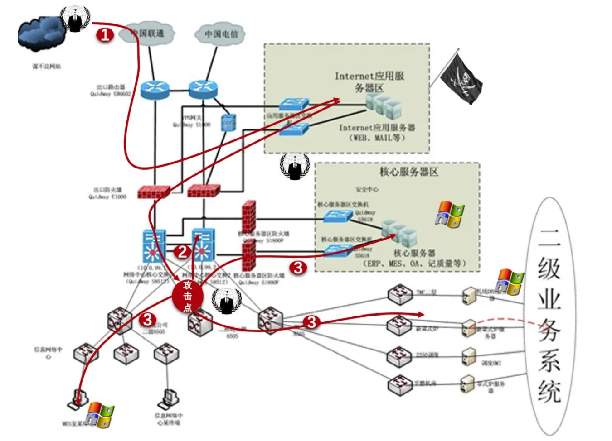
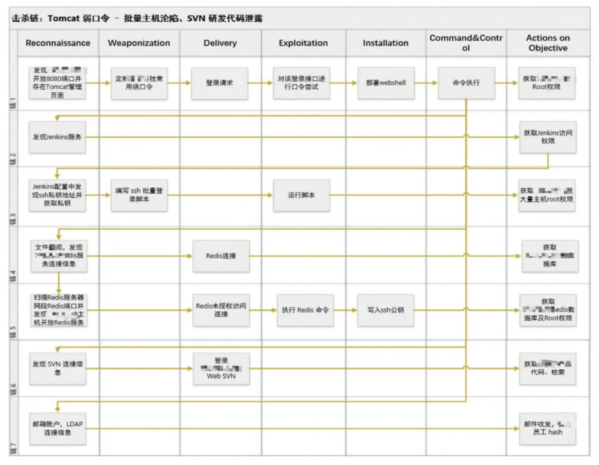
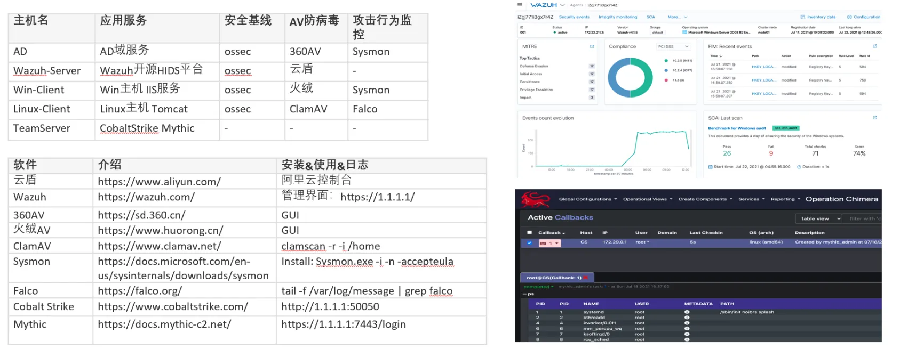
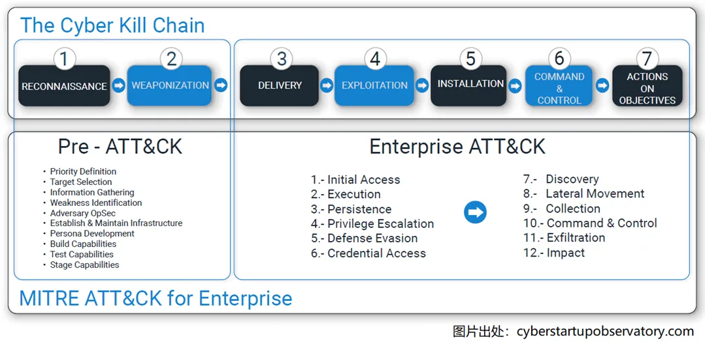
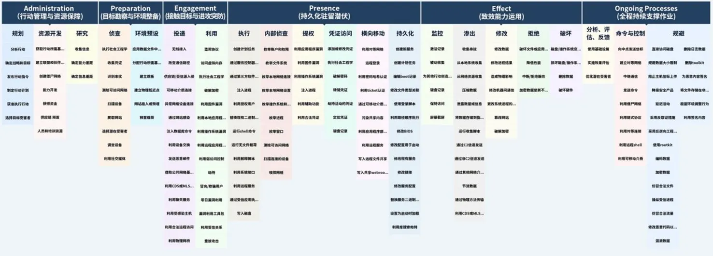

## 一、红蓝对抗介绍 

蓝军是指在军事模拟对抗演习中专门扮演假想敌的部队，通过模仿对手的作战特征与红军进行针对性的训练对抗。国内企业安全蓝军（国外称为红队 RedTeam）以攻击者视角对人员、业务、基础设施、安全系统进行模拟攻击，持续暴露安全隐患和防控薄弱点，评估和促进企业安全的防御、监测和应急处置的整体安全水位。

### 红蓝对抗技术能力 

### 红蓝对抗核心技战法  

| 0day 挖掘储备 | ●安全设备类：堡垒机漏洞、终端 EDR 漏洞、 ●流量监控设备漏洞、VPN 设备漏洞 ●企业产品类：邮服漏洞、OA 漏洞 |
| ------------- | ------------------------------------------------------------ |
| 社工与内网    | ●社工：邮件钓鱼（邮件伪造、场景伪装） ●通讯钓鱼（招聘平台、通话欺骗）+水坑攻击  ●内网：安全产品集权类设备 + 域渗透 + 横向移动 |
| 外网打点      | ●自动信息手收集 + 人工漏洞打点（0day、1day、供应链）         |
| 常见入侵路径  | ●对外提供的服务； VPN 接入服务；  ●分支机构、合作单位；旁站、C 段 |

## 二、高级持续性攻击风险 

APT 攻击是针对特定目标的高级持续性攻击（Advanced Persistent Threat）的简称。这种攻击通常由国家级或专业的网络攻击者发起，目的是长期侵入目标网络，收集机密信息。

APT 攻击的危害非常严重，因为它们可以持续很长时间，而攻击者可以不断收集敏感信息。它们还可能导致系统瘫痪、数据泄露、财务损失等。因此，重要的数据和网络安全必须通过多重防御措施，包括网络监测、强制访问控制、数据加密等，来防范 APT 攻击。

### 维基解密CIA绝密文件泄露事件 

2017年3月7日，维基解密（WiKiLeaks）公布了数千份文档并揭秘了美国中央情报局关于黑客入侵技术的最高机密，根据泄密文档中记录的内容，该组织不仅能够入侵iPhone手机、Android手机和智能电视，而且还可以入侵攻击Windows、Mac和Linux操作系统,甚至可以控制智能汽车发起暗杀活动。外界将此次泄漏事件取名为Vault 7，Vault 7公布的机密文件记录的是美国中央情报局（CIA）所进行的全球性黑客攻击活动。

Vault7包含8761份机密文档及文件，这些文件记录了CIA针对Android以及苹果智能手机所研发的入侵破解技术细节，其中有些技术还可以拿到目标设备的完整控制权。维基解密创始人阿桑奇表示，文件显示出“CIA网络攻击的整体能力”，而维基解密在发布这些文件时声称“CIA的网络军械库已失控”。

### 影子经纪人公开NSA（美国国家安全局）黑客武器库 

2017年4月14日，影子经纪人（Shadow Brokers）在steemit.com上公开了一大批NSA（美国国家安全局）“方程式组织” (Equation Group)使用的极具破坏力的黑客工具，其中包括可以远程攻破全球约70%Windows机器的漏洞利用工具。任何人都可以使用NSA的黑客武器攻击别人电脑。其中，有十款工具最容易影响Windows个人用户，包括永恒之蓝、永恒王者、永恒浪漫、永恒协作、翡翠纤维、古怪地鼠、爱斯基摩卷、文雅学者、日食之翼和尊重审查。黑客无需任何操作，只要联网就可以入侵电脑，就像冲击波、震荡波等著名蠕虫一样可以瞬间血洗互联网。

### 震网病毒 Stuxnet 2010年 

Stuxnet作为世界上首个网络“超级破坏性武器”，这也是第一次使用计算机病毒来操纵物理世界的事件。该病毒在伊朗工控系统潜伏了5年之久，并通过感染超过200,000台计算机以及导致1,000台机器物理降级，对伊朗整体核计划的约五分之一造成了重大损害。

## 三、红蓝对抗实战攻击案例 

### 红蓝对抗典型攻击途径 

### 影子资产攻击 

对目标边缘影子资产进行迂回攻击。声东击西，穿插攻击。 多数情况下，攻击人员难以直接通过正面攻击获取权限，会利用自研的自动化攻击工具，以最快的速度在海量目标边缘资产中，找到可供突破的防守薄弱点。一般情况下，会先 采用自动化工具进行第一波突破，若无果，再采用遍历攻击面的方式，采用人工挖掘的方式，对目标资产进行细致的安全审查，以获取疏于防护的目标资产权限。  

### 社工攻击 

针对目标相关人员进行社会工程学攻击。没有绝对安全的系统，人是网络安全的关键因素。 随着安全防护技术及安全防护产品应用的日益成熟，很多常规的攻击手段越来越难以奏效。通过前期收集到的人员信息与其相关业务信息，利用 QQ 群聊，微信聊天等方式，降 低目标人员的戒备心，并编写招聘广告，业务互动等符合目标个人需求的钓鱼木马，进行社会工程学攻击，进而成功突破具有高安全防护目标的安全策略。  

### 0day 攻击 

利用 0day 漏洞对目标主要资产正面突破。攻敌之不备，出奇以制胜。 对常见通用系统进行漏洞挖掘，并储备充足的 0day 炮火支援。针对目标使用的通用系统，使用 0day 漏洞对其进行快速的，精准的打击。虽然防守方在主要业务系统上部署了大 量防火墙、云防护、IPS 等安全设备和安全防护策略，但由于 0day 漏洞的未知性与隐蔽性，仍可快速获取目标核心业务网络入口主机权限，并以此为跳板进行内网横向移动。

### 供应链攻击 

通过目标关联供应链进行侧面攻击 通过接入天眼查，Fofa，Github，Censys 等网络公开信息渠道及公司自有网络空间测绘系统，获取关于目标组织的人员信息、组织架构、网络资产、技术框架及安全措施信息。同 时收集其分支机构、关联公司、外包公司、投资公司、人员、网络、主机、域名、帐户、邮箱等信息。尽可能多的信息为攻击决策提供强有力的数据支撑，攻击队员在攻击后对 直击目标的防守短板。  

## 四、红蓝对抗防守方案   

### 模拟实战靶场平台 

模拟实战攻击训练，攻击工具熟练使用，系统漏洞的熟练利用，攻防角度双向观察，对抗杀毒软件，对抗行为监控等。

网络靶场005：外网应用入口（IIS、Tomcat），内网服务（Windows、Linux、AD、Exchange），防护系统（Wazuh、AV、Sysmon、Falco），攻击平台（CS、Mythic）。

## 五、红蓝对抗威胁框架 

网空威胁框架是一套科学的方法和工具体系，能够更深入地认知APT形式的网空威胁，系统全面地分析其攻击意图、手法、过程与技术，达成增强防御有效性的目标。

### 网络杀伤链（Cyber Kill Chain） 

洛克希德-马丁公司的网络杀伤链（Cyber Kill Chain）提供了一个概念模型来描述攻击过程，和对攻击如何运作以及在每个阶段使⽤的不同⼯具和⽅法的深⼊了解。 

参考网络杀伤链（Cyber Kill Chain）从攻击者视角建设、评估和提升对抗能力，⽹络杀伤链七个阶段，如下图所示： 

网络杀伤链七个阶段，分别是“侦察-武器化-投递-利用-安装-命令控制-行动达成目的”。 

1侦察：研究、确定和选择目标，包括对开源情报的被动侦察或主动侦察，其中探测面向互联网的系统的潜在弱点。			

2武器化：攻击者根据在侦察阶段检索到的信息为特定⽬标创建恶意程序/⽂件。通常 PDF 或 Office 文档可以作为恶意载荷的武器化载体。			

3投递：通过使⽤不同的⽅式将精⼼设计的攻击载荷传送给受害者，例如：电⼦邮件（附件）、⽹络钓⻥、⽹站、物理设备或社会⼯程。			

4利⽤：触发或激活恶意程序/⽂件成功渗透⽬标的系统和⽹络。分阶段的恶意软件攻击限制了检测的可能性。恶意软件将通过安全通道与恶意攻击者进行通信。		

5安装：执行恶意攻击程序或软件的实际安装，为了使恶意软件和后⻔程序持久存在，攻击者可以安装额外的恶意软件⼯具，以确保在系统受损或恶意软件被禁⽤时攻击可以继续进行。			

6命令控制：受感染的系统通常会回连攻击者，以建⽴命令和控制通道，从⽽允许远程控制恶意软件。尤其是在⾼级持续威胁 (APT) 恶意软件中，攻击者将通过使⽤此类远程控制恶意软件并探索⽹络。			

7行动达成目的：通过使⽤受感染的系统作为起点“横向移动”到其他系统/⽹络，以搜索其他⾼价值资产或⽬标。直到攻击者完成其恶意行为或实现其⽬标，之后攻击者将尝试使⽤不同的技术来掩盖其数字踪迹和痕迹。

### MITRE ATT&CK 框架 

MITRE ATT&CK (Adversarial Tactics, Techniques, and Common Knowledge) 是由 MITRE 维护的，描述了攻击者在网络攻击中使用的技术和策略的数据库。ATT&CK 提供了一种标准化的方法，用于识别和评估攻击技术，帮助组织识别潜在的安全威胁并采取相应的防御措施。

### TCTF框架 

TCTF (Threat Hunting, Detection, and Response Framework) 框架是 NSA 发布的。通过参考网空杀伤链、ATT&CK等多种现有威胁框架，TCTF框架以阶段（Stage）、目标（Objective）、行为（Action）和关键短语（Key Phrases）所组成的四层描述结构，构造了一个与网空行为活动紧密结合的通用技术词典。

