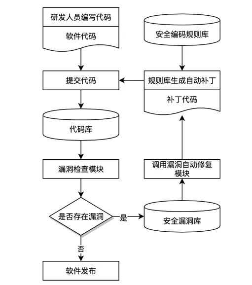

## 一、背景 

随着信息技术的发展，众多研发人员开发的大量信息系统，形成了人们日常生活越来越依赖的庞大的互联网体系，已成为整个社会的基础设施且越来越重要。保护信息系统的安全需要对组成信息系统的代码加强防护是非常重要的。在软件代码开发环节实施安全检测修复和管理是一种保护信息系统安全的重要方法。 软件代码开发流程中的安全检测和修复工作，大多是通过开发人员将软件代码提交到代码库后进行自动化安全检查，实时监控代码库新提交的软件代码的事件并拉取相应代码数据，然后通过代码特征分析后与安全编码规则进行比对，发现和定位软件代码存在的安全缺陷和风险，发出漏洞报告通知开发人员修补漏洞，缺乏相应自动化修复手段。

## 二、软件代码漏洞修复现状 

目前，一旦发现软件代码存在的安全缺陷和风险，开发人员需要了解该漏洞风险和修复方法，然后编写补丁代码并提交到代码库，通过人工手动完成修复。由于软件新功能新需求不断迭代代码量庞大，还有开发人员流动性导致经常修改他人的代码且安全漏洞种类繁多，这种方法不仅工作量大且繁琐，还严重耗费大量时间和人力等资源。

## 三、软件代码漏洞自动化修复方案 

本技术方案提供一种基于安全编码规范的软件代码漏洞自动修复方法，包括预先根据安全编码规范建立的安全编码规则库，然后基于漏洞检查模块执行代码拉取检测和修复过程。

###  自动化修复技术优势 

根据不同等级漏洞修复时间要求：严重漏洞1天修复、高危漏洞3天修复、中危漏洞7天修复、低危漏洞14天修复，一个软件漏洞修复平均时间五天左右，通过软件漏洞自动化修复过程能够在小时级别完成漏洞修复。 根据不同软件开发人员的技术水平、不安全代码的熟悉程度和对漏洞种类的熟悉程度，平均修复一个软件漏洞消耗人力0.5人天，通过软件漏洞自动化修复过程近乎无人力消耗。

### 自动化修复流程示意图 

所述安全编码规则库包含软件代码开发安全编码规范所涉及安全规则项的基本信息，每个安全规则项的基本信息包括安全规则项名称、安全规则项特征值、安全补丁修复代码，针对不同编程语言分别能够采用的安全规则检测方法及相应指令、安全漏洞修复方法及相应指令，和用于唯一标示安全规则项名称的安全规则项编号。

所述检查过程，包括根据安全编码规则项名称和编程语言类型确定漏洞检查方法及指令，实时拉取软件代码数据；逐个将拉取到的代码文件与安全编码规范库中的相应安全规则项进行比对，对不满足安全编码规则特征值的软件代码确定为安全漏洞，并把安全漏洞保存在安全漏洞库中，得到漏洞数据；

所述安全漏洞库包含安全漏洞的基本信息，每个安全漏洞的基本信息中包括安全漏洞项名称、拉取的软件代码文件，和于安全编码规则项编号一致的安全漏洞编号。

所述修复过程，包括当安全漏洞库中有未修复的安全漏洞时，从安全漏洞库获取安全漏洞，根据安全漏洞编号从安全编码规则库获取相应安全规则项的安全补丁修复代码，并根据安全漏洞编号和编程语言类型确定漏洞修复方法及指令，对存在漏洞的代码修复为安全补丁修复代码。

而且，对于每个安全规范规则项，各种编程语言类型分别能够采用的漏洞检查方法为以下四种之一，

●读取代码文件哈希值，如md5值

●读取应用依赖软件的版本号

●读取软件代码块信息

●读取应用配置文件信息

而且，对于每个安全编码规则项，各种编程语言类型分别能够采用的漏洞修复方法为以下四种之一，

●替换存在漏洞的代码文件

●修改依赖软件的版本号

●替换存在漏洞的代码块

●修改应用软件配置文件

## 四、总结 

随着DevOps持续集成部署流程不断发展，已被所有互联网厂商应用，DevSecOps持续集成中的安全检测流程已经是互联网各大厂开始探索和布局落地，该方案目前还未有相关的概念和方法被提出，由于该方案能以十倍到百倍地减少漏洞修复时间和人工成本，具备被广泛应用的市场规模和前景。