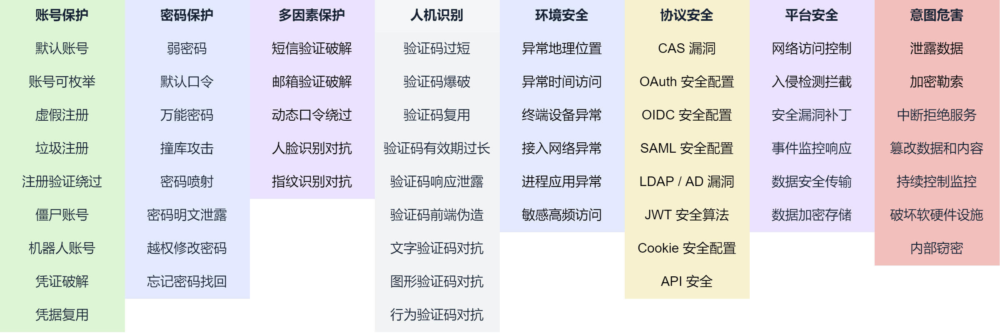
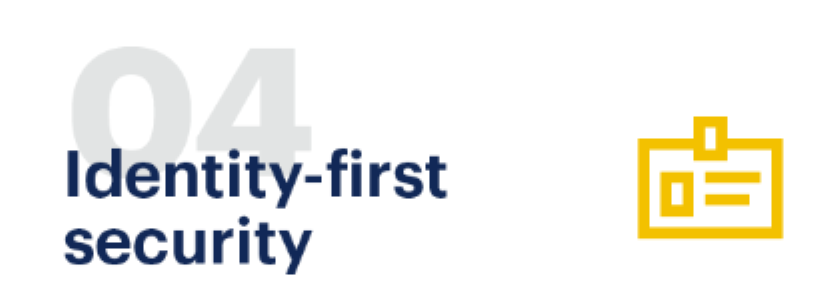
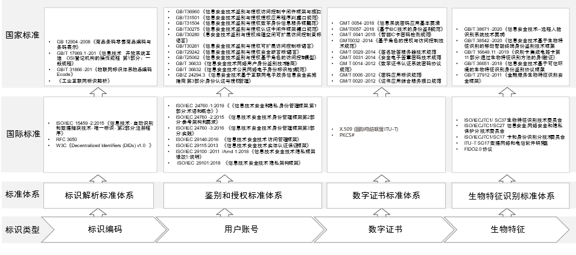

## 权威报告研究

关于身份风险：网络入侵难以完全杜绝的根本原因在于攻击是通过合法用户凭据发起的，这使得非法攻击看起来就像是普通用户访问一样。

美国 NSA 前监察长曾指出，犯罪分子可以利用在黑市上买来的凭证访问几乎所有机构的信息。

[Gartner Top Security and Risk Trends for 2021](https://www.gartner.com/smarterwithgartner/gartner-top-security-and-risk-trends-for-2021) **- November 15, 2021**

- **Trend No. 4: Identity-first security**

- 混合工作和向云应用程序的迁移巩固了身份作为安全边界的趋势。身份优先安全并不是个新概念，但随着攻击者开始瞄准身份和访问管理功能以实现长期潜伏，身份优先安全变得更加紧迫。
- 凭据滥用现在是攻击行为中最常用的技术。国际黑客组织以Active Directory和身份基础设施为目标，取得了惊人的成功。身份是突破物理隔离网络的关键横向移动技术。多因素身份验证(MFA)的使用正在增长，但它不是万能的。企业必须更加重视MFA的正确配置、维护并监控身份基础设施。

[Gartner Identifies Top Security and Risk Management Trends for 2022](https://www.gartner.com/en/newsroom/press-releases/2022-03-07-gartner-identifies-top-security-and-risk-management-trends-for-2022) **March 7, 2022**

- **Trend 3: Identity Threat Detection and Response**
- 复杂的威胁参与者正在积极瞄准身份和访问管理 (IAM) 基础设施，而凭据滥用现在是主要的攻击媒介。Gartner 引入了术语“身份威胁检测和响应”(ITDR) 来描述用于保护身份系统的工具和最佳实践的集合。
- “组织花费了大量精力来改进 IAM 功能，但其中大部分都集中在改进用户身份验证的技术上，这实际上增加了网络安全基础设施基础部分的攻击面，”Firstbrook 表示：“ITDR 工具可以帮助保护身份系统，检测它们何时受到损害并实现有效的补救。”

[Gartner Top Security and Risk Trends in 2022](https://www.gartner.com/en/articles/7-top-trends-in-cybersecurity-for-2022) **- April 13, 2022**

- **Trend No. 2: Identity system defense**
- 身份系统正受到持续的攻击。滥用凭据现在是攻击者用来访问系统并实现其目标的主要方法。例如，在SolarWinds漏洞中，攻击者使用供应商的特权访问权限来渗透目标网络。

**IDSA 2022 数字身份保护趋势报告 (**[Trends in Securing Digital Identities](https://steamory.feishu.cn/docx/JzSTdCPnUoNVcKxshAXcqHbMnbd)**)**

- 令⼈震惊 84% 的组织在过去一年中经历过与身份相关的泄露事件。最常见的泄露归因是网络钓鱼攻击 (59%)，权限管理不当 (36%) 和凭据被盗 (33%)。 
- 失陷事件通常涉及网络钓鱼和被盗凭据。威胁行为者可以利用这些凭据的访问权限，绕过 IT 限制、窃取数据、部署勒索软件或采取其他恶意行动。 
- ⼏乎所有安全和身份专家 (97%) 都表示，他们组织将在明年投资于以身份为中心的安全架构。

**CSA 2022 云计算面临的主要威胁报告 《**[SANS 2022 Top New Attacks and Threat Report](https://information.rapid7.com/rs/411-NAK-970/images/Whitepaper_2022-Attacks-Threat-Report_Rapid7.pdf)**》**

- 报告调查了 700 名安全专业人士，发现了 19 种与云相关的安全事件最常见的攻击路径，排名第一位的是⾝份、凭据、访问和密钥管理水平不足。
- 较差的身份安全保护再一次被列为最关键的领域，本质上是阻止网络钓鱼攻击和其他窃取可重复使用密码的尝试的能力。

**Microsoft 2022 微软数字防御报告**([Microsoft Digital Defense Report](https://www.microsoft.com/en-us/security/business/microsoft-digital-defense-report-2022))

- 微软监测数据称，99％ 被入侵的帐户未启用多因素身份验证。目前以多因素认证（MFA）、无密码方案为代表的强身份认证的使用率还很低，而那些仅仅依靠密码保护的账号，常常成为黑客们最容易得手的目标。[详情链接](https://published-prd.lanyonevents.com/published/rsaus20/sessionsFiles/18466/2020_USA20_IDY2-F03_01_Breaking-Password-Dependencies-Challenges-in-the-Final-Mile-at-Microsoft.pdf)
- 微软安全洞察，身份管理漏洞成为数字安全首要威胁。确保身份认证及管理的安全性是确保数字安全的重中之重。强化身份管理，是应对数字威胁最行之有效又简便易行的手段。[详情链接](https://news.microsoft.com/zh-cn/微软洞察：身份管理漏洞成为数字安全首要威胁/)

**Verizon 2022 数据泄露调查报告** ([Data Breach Investigations Report](https://www.verizon.com/business/resources/reports/2022/dbir/2022-data-breach-investigations-report-dbir.pdf))

- 报告称被盗凭据仍然是恶意行为者用来实施数据泄露的第一大黑客策略。黑客入侵导致的数据泄露事件中，超过 60% 涉及丢失、被盗或可破解的凭据或网络钓鱼。
- 报告指出，目前有四个主要途径会威胁到数据资产：凭证窃取、网络钓鱼、漏洞利用和僵尸网络。

**身份和访问管理标准体系**

## 风险案例研究

[2022年度全球数据泄露事件TOP 20](https://www.secrss.com/articles/48764)

[2022年网络攻击事件盘点](https://mp.weixin.qq.com/s/afXYJHoNcy5tg7TqSgcVzQ)

[2022年数据泄露事件盘点](https://mp.weixin.qq.com/s/va1el2MjQe1LdwwolKG6-g)

1. 随着 MFA 多因素认证普及，对抗 MFA 的网络钓鱼即服务 Phishing-as-a-Service (PhaaS) 已经实现产品化，支持针对主流在线服务身份验证令牌的窃取，包括：Apple、Google、Facebook、Microsoft、Twitter、GitHub、GoDaddy。
2. 黑客针对大多数企业的攻击者中，出于经济利益或者政治活动，利用恶意软件和电脑病毒等手段窃取信息，以达到攻击目的。搜狐员工遭遇工资补助诈骗。经调查，实为某员工使用邮件时被意外钓鱼导致密码泄露，进而被冒充财务部盗发邮件。据统计，共有24名员工被骗取4万余元。[链接](https://www.chinaz.com/2022/0525/1400166.shtml)
3. “内鬼”泄密，公司内部人员因安全意识不足导致泄密，或者前员工有意曝光公司重要数据。知名漏洞众测平台 HackerOne 的一名员工，利用工作职务之便，窃取通过漏洞赏金平台提交的漏洞报告，出售给那些受影响的用户，以此索取现金奖励。据 HackerOne 表示，这名员工联系了7名HackerOne 客户，并在少数披露中获取了赏金。[链接](https://www.freebuf.com/news/338142.html)
4. 系统漏洞，黑客利用系统上存在的漏洞进入系统并窃取登录凭证后发动网络攻击。有安全研究人员发现，攻击者利用微软 MSHTML 远程代码执行漏洞（CVE-2021-40444），通过PowerShell 恶意软件窃取器，来窃取受害者谷歌和在线服务凭证信息。[链接](https://www.163.com/dy/article/GQ69HUEN0511CJ6O.html)
5. 云通讯巨头Twilio 表示，有攻击者利用短信网络钓鱼攻击窃取了员工凭证，并潜入内部系统泄露了部分客户数据。
6. 美国网约车巨头Uber发生了重大黑客攻击事件，一名黑客获得了Uber一位员工的Slack账号，并获取了该公司在亚马逊和谷歌云计算平台的访问权限。位于旧金山的Uber公司目前已经证实了这次黑客攻击，公司上下正在匆忙评估这次黑客攻击造成的损失。
7. 继三星微软之后Lapsus$黑客组织宣布入侵LG、Okta、Cloudflare。对三星电子、微软、英伟达、沃达丰等巨头发起网络攻击的外国黑客组织Lapsus$宣布，该组织也入侵了LG电子。该组织在Telegram上上传了一份文件，声称这是LG电子员工和服务账户的哈希值。在透露这一消息时，该组织还在其Telegram账号上发布了自称是Okta内部系统的截图，其中一张似乎显示了Okta的Slack频道，另一张是Cloudflare界面。LG电子表示，到目前为止，尚未确认客户相关信息的泄露。
8. 黑客伪造“政府传票”窃取科技巨头敏感数据，苹果、脸书等均受影响。安全博客KrebsOnSecurity披露了一种伪装政府执法部门向互联网公司套取用户数据的攻击手法，攻击者窃取执法部门邮箱等官方账号，向互联网平台发送“紧急数据申请”，从而套取用户敏感数据。最近兴起的LAPSUS$数据勒索团伙正是利用这一手法为基础，成功入侵了微软、Okta、英伟达等知名企业内网窃取数据，苹果、Meta等巨头曾应黑客要求提供用户数据。
9. 黑客用GitHub用户令牌从数十家企业内部系统窃取信息。GitHub安全研究人员报告称，4月12日，一名未知的攻击者使用被盗的Heroku和Travis CI维护的第三方OAuth用户令牌从数十家企业的私有存储库中下载数据。虽然目前尚不清楚究竟有多少企业受到了此次活动的影响，但根据软件供应链保护提供商BluBracket的说法，可以确认的是攻击者“利用了npm私有库中的AWS密钥。”因此，此次曝光的数据泄露不仅限于GitHub，还可能波及集成了Heroku/Travis的所有应用程序。

## 身份优先安全风险清单

### 1.账号保护

#### 默认账号

很多系统都会有默认的账号，比如管理后台都会有个admin、root、system账号，攻击者免去破解账号名称，使用默认账号尝试发起攻击。

#### 账号可枚举

攻击者根据应用程序返回的不同的出错信息可枚举出系统中存在的账号信息，然后针对枚举出来的登录用户名，对其密码进行暴力破解。

#### 虚假注册

通过使用应用程序的帐户注册流程，提供虚假的身份数据注册账号，利用虚假的身份注册虚假账号便于后续攻击。

#### 验证绕过

应用程序在认证上没有做好，可以导致恶意用户或者攻击者绕过认证，访问内部资源。

#### 恶意锁定

通过不断的输入错误的密码可恶意锁定任意账号。若系统认证功能无人机识别功能模块，攻击者可编写脚本批量锁定系统账号。

#### 僵尸账号

由于各种历史原因，很多账号处于无人使用状态。这种长时间没有登录行为，如果突然在某个时刻再次被使用，很可能是被攻击者掌握。

#### 凭证破解

攻击者使用自动化脚本组合出常见的用户名和密码，即字典，再结合高并发破解软件进行暴力破解。

#### 凭证复用

很多账户系统在账户改密码之后并不能清除已有的登录状态，导致在盗用或使用 Cookies 的情况之下，可以一直维持对目标用户的登录权限。

### 2.密码保护

#### 弱密码

 仅包含简单数字和字母的密码，例如”123”、”abc”等，这样的密码很容易被别人破解。通过爆破工具就可以很容易破解。

#### 默认口令

 很多系统都会有出厂的默认密码，攻击者会收集各种类型系统的默认密码，如果管理员没有及时修改默认密码，很可能会被攻击者利用。

#### 万能密码

 攻击者可通过万能密码直接登录后台，获取后台权限，构造特殊的 SQL 语句进行截断，造成永真，就可以越过查询完成登录。

#### 撞库攻击

 攻击者使用从其他地方窃取的身份验证凭据，通过批量登陆，验证被盗账号密码在当前系统中的有效性。

#### 密码喷射

 通过暴力枚举众多账号列表的特定脆弱密码尝试登陆，攻击者将有可能获得当前系统上使用脆弱密码的用户权限。

#### 密码明文泄露

 认证过程中用户名密码等敏感数据明文传输，攻击者通过在局域网中嗅探网络流量，获取明文传输的认证凭证，如用户名密码、SESSIONID等敏感信息。

#### 越权修改密码

 修改密码处如果没有校验旧密码、短信验证码、存在越权漏洞等问题，导致攻击者可利用该漏洞直接修改其他用户的密码。

#### 忘记密码找回

 在未知他人的重置密码链接或手机验证码的情况下，攻击者通过构造重置密码链接或穷举手机验证码的方式直接重置他人的密码。

### 3.人机识别

#### 验证码失效

 常见的让验证码失效的方式有把验证码参数值填空，或者验证码参数删掉，系统不再返回验证码错误。

#### 验证码复用

 验证码使用多次不失效，攻击者利用这个缺陷来绕过验证码。攻击者多次请求都是使用的同一个验证码，系统返回都请求成功。

#### 验证码伪造

 由客户端来生成验证码，或者由客户端来判断验证码，攻击者通过逆向客户端程序，来伪造合法的验证码，绕过验证机制。

#### 文字验证码对抗

 主要是通过用户输入图片中的字母、数字、汉字等进行验证。简单易操作，人机交互性较好，但安全系数低，容易被破解。采用OCR技术可轻松破解。

#### 图形验证码对抗

 按照指定顺序点击正确的图标，即可完成验证。需按照常用语的顺序点击正确的文字，即可完成验证。

#### 行为验证码对抗

 按照要求将备选碎片直线滑动到正确的位置，或拖动滑块移动来达到验证目的。维度单一，容易被逆向模拟。

#### 智能验证码

 通过行为特征、设备指纹、数据风控等技术，正常用户免验证，异常用户强制验证。简单便捷，区分人与机器、人与人、设备与设备。

### 4.多因素保护

#### 短信验证爆破

 短信验证码位数太短或有效期太长导致可暴力破解，验证码错误次数超过上限应触发短信验证码失效重新发送等保护机制。

#### 邮箱验证爆破

 邮箱验证码位数太短或有效期太长导致可暴力破解，验证码错误次数超过上限应触发验证码失效重新发送等保护机制。

#### 动态口令绕过

 系统实现存在缺陷，在验证完账号密码后，COOKIE 已经拥有登录态，导致不填入动态口令也可以直接访问后台系统，绕过动态口令认证。

#### 人脸识别对抗

 人脸识别技术已得到广泛应用，攻击者使用一段带有用户人脸的视频，或者3D打印的人脸面具，就可以骗过认证系统。

#### 指纹识别对抗

 通过采集用户遗留在各种物体表面上的指纹印记，重构出带有纹理沟壑的指纹膜，套在任何人手上，就可以成功骗过一般的指纹识别。

### 5.协议安全

#### CAS 漏洞

 CAS 反序列化命令执行漏洞

#### OAuth 安全配置

 state 参数处理不当，redirect_uri 地址绕过，code 参数泄露

#### OIDC 安全配置

 nonce 参数处理不当、request_uri 参数 SSRF 漏洞

#### SAML 安全配置

 数字签名和加密的加密材料，用于配置远程实体提供的可信加密材料的安全配置文件以及HTTPS连接的验证

#### LDAP / AD 漏洞

 LDAP 注入漏洞、Kerberos 协议攻击

#### JWT 安全算法

 弱密钥、密钥泄露、未校验签名、空加密算法

#### Cookie 安全配置

 会话固定、会话泄露、未设置HTTPONLY、未设置SECURE

### 6.环境安全

#### 异常地理位置

 用户登录的地理位置产生异常变化

#### 异常时间访问

 用户在非常用时段登录成功

#### 终端设备异常

 非常用设备、终端补丁加固、终端防病毒、设备安全状态

#### 接入网络异常

 办公网、公共网络、家庭网络、移动网络、恶意源地址

#### 进程应用异常

 访问敏感数据、窃取凭据、执行恶意命令

#### 敏感高频访问

 用户在登录后，在短时间内，连续访问多个不同的系统

### 7.平台安全

#### 网络访问控制

 保护网络边界面临的外部攻击。控制网络流量和边界，对网络进行强制隔离，在公司网络中，只允许被授权的服务和协议传输，未经授权的数据包将被自动丢弃。

#### 入侵检测拦截

 对成千上万的网络日志等信息进行自动分析处理与深度挖掘，对网络的安全状态进行分析评价，快速感知到网络中的异常事件与整体安全态势。

#### 安全漏洞补丁

 采用自动化的漏洞扫描工具定期进行服务器漏洞检测，第一时间进行处理修复，定期进行系统补丁更新，有效保障服务器稳定运行。

#### 事件监控响应

 安全事件的收集、归并和过滤。通过安全事件监控整个组织内的 IT 资源，过滤并关联事件，迅速定位安全威胁，并启动安全事件响应。

#### 数据安全传输

 数据传输皆受 AES 密钥加密强度的保护，完全满足敏感数据加密传输需求。通过 HTTPS 协议，信息在终端端到云端实现加密传输。

#### 数据加密存储

 加密数据存储，使用 KMS 管理密钥，为敏感数据提供可持续的信息保护，实现数据安全保护和控制。